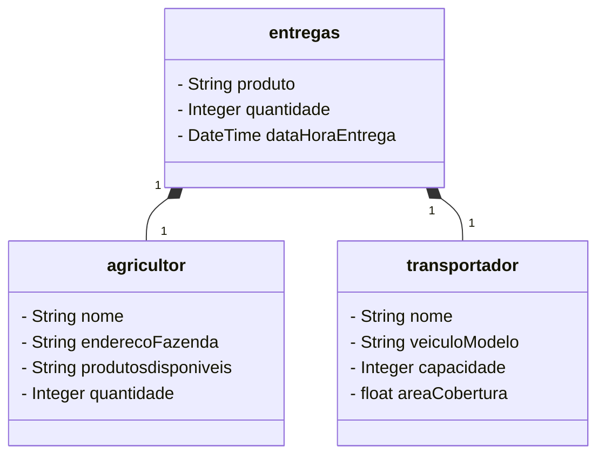
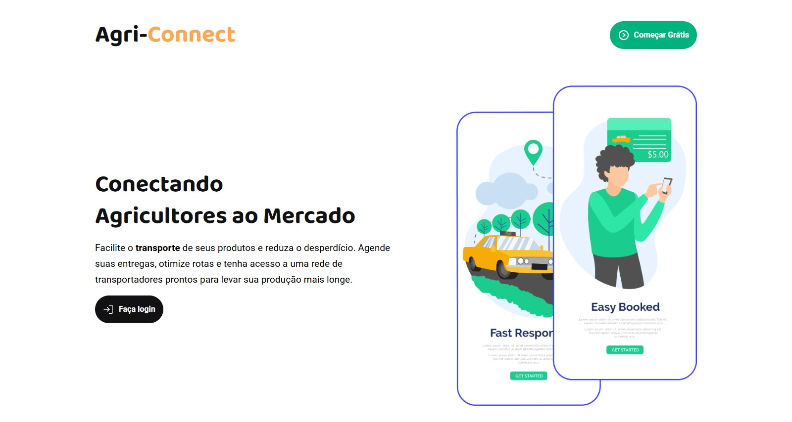
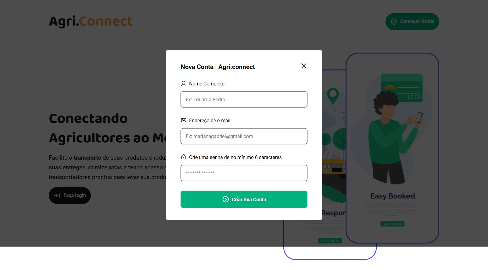
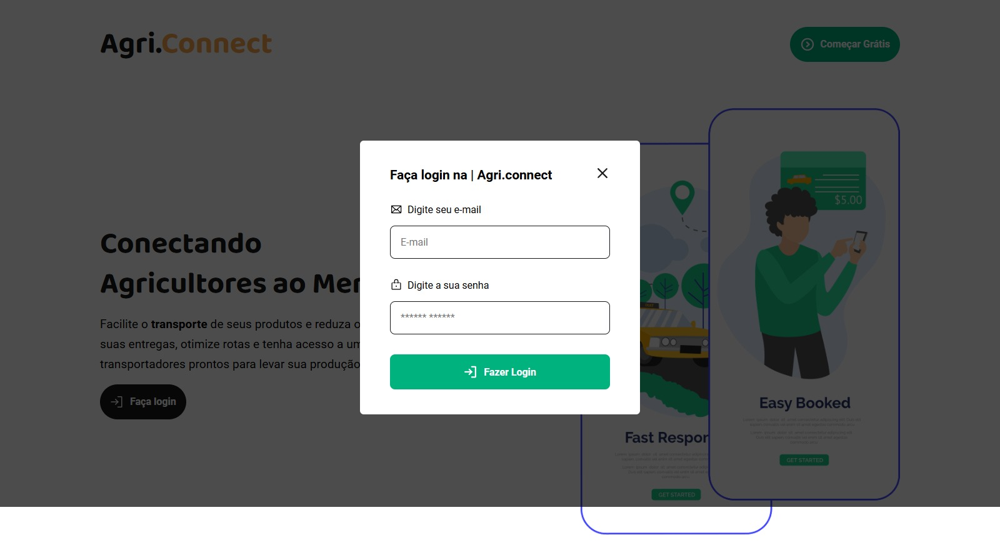
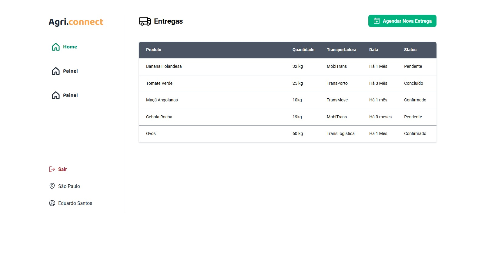

### Projeto AgriConnect Aplication

<p>
    Plataforma que conecta pequenos agricultores a transportadores locais, facilitando o agendamento de entregas e otimizando a logística de escoamento de produtos agrícolas para mercados e consumidores.
</p>

### Modelo de domínio AgriConnect



## Dependencia para usar no pom.xml

```xml


```

### Protótipo






### Tecnologias Ultilizadas

## Back-End

<ul>
	<li>Java</li>
	<li>Spring Boot</li>
	<li>H2</li>
	<li>Database JPA</li>
	<li>SQL</li>
	<li>Maven</li>
	<li>Docker</li>
	<li>Postgresql</li>
</ul>

## Front-End

<ul>
	<li>ReactJs</li>
	<li>Sass</li>
	<li>TypeScript</li>
</ul>
