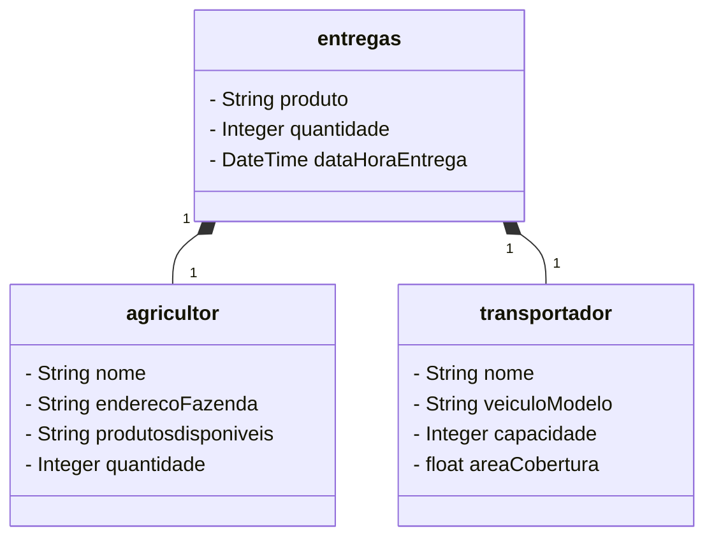

```mermaid
classDiagram

class agricultor{
 - String nome
 - String enderecoFazenda
 - String produtosdisponiveis
 - Integer quantidade
}

class transportador{
 - String nome
 - String veiculoModelo
 - Integer capacidade
 - float areaCobertura
}

class entregas{
 - String produto
 - Integer quantidade
 - DateTime dataHoraEntrega
}

    entregas "1"*--"1" agricultor
    entregas "1"*--"1" transportador

```
