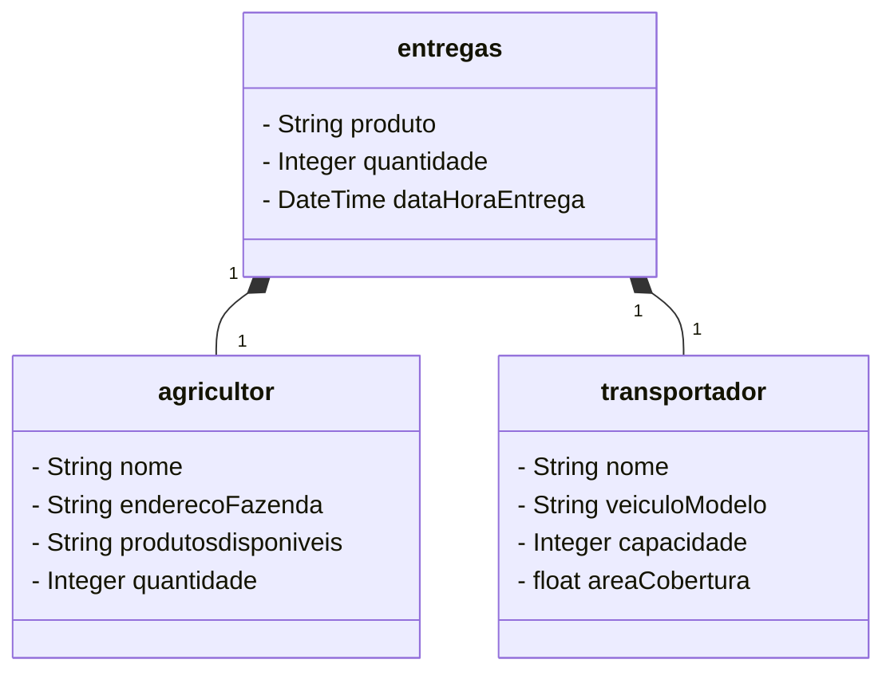

## Projeto AgriConnect Aplication

## Modelo de domínio AgriConnect

REQUISITOS FUNCIONAIS DO APLICATIVO
1. Cadastro de Usuários (Agricultores e Transportadores)
O sistema deve permitir o cadastro de agricultores e transportadores.
Campos obrigatórios para o agricultor: Nome, Localização (endereço da fazenda), Produtos Disponíveis, Quantidade.
Campos obrigatórios para o transportador: Nome, Veículo, Capacidade, Área de Cobertura.
Login e autenticação para garantir segurança de acesso.

1.2 Agendamento de Entregas
Agricultores devem ser capazes de agendar a entrega de produtos.
O agendamento deve incluir: Produto, Quantidade, Data/Hora da entrega.
O sistema deve sugerir transportadores disponíveis com base na localização e capacidade de transporte.

1.3 Visualização de Rotas
O sistema deve calcular a melhor rota para cada entrega.
Integração com API de mapas (Google Maps ou Mapbox) para sugerir o melhor trajeto.
Agricultores e transportadores devem poder visualizar o trajeto da entrega no mapa.

1.4 Gerenciamento de Entregas
Agricultores devem poder acompanhar o status da entrega em tempo real (Ex: Pendente, Em Transporte, Concluída).
Transportadores devem poder atualizar o status da entrega conforme o progresso.

1.5 Histórico de Entregas
O sistema deve manter um histórico das entregas realizadas para agricultores e transportadores.
Agricultores e transportadores devem poder acessar um relatório com datas e volumes entregues.

1.6 Notificações
Agricultores e transportadores devem ser notificados sobre o status de suas entregas (confirmação de agendamento, início da entrega, conclusão).
Notificações via email ou push notifications.

1.7 Relatório de Desempenho
O sistema deve gerar relatórios simples sobre o desempenho das entregas (quantidade entregue, distância percorrida, tempo médio de entrega).
Agricultores e transportadores devem poder acessar suas métrica
